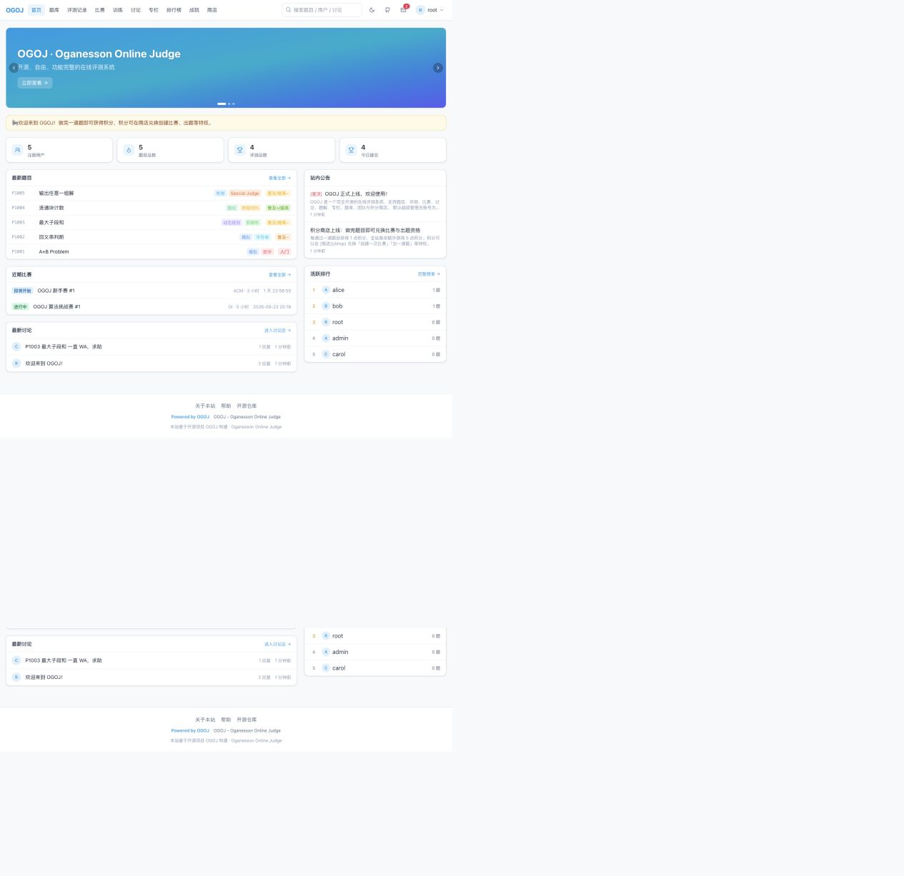
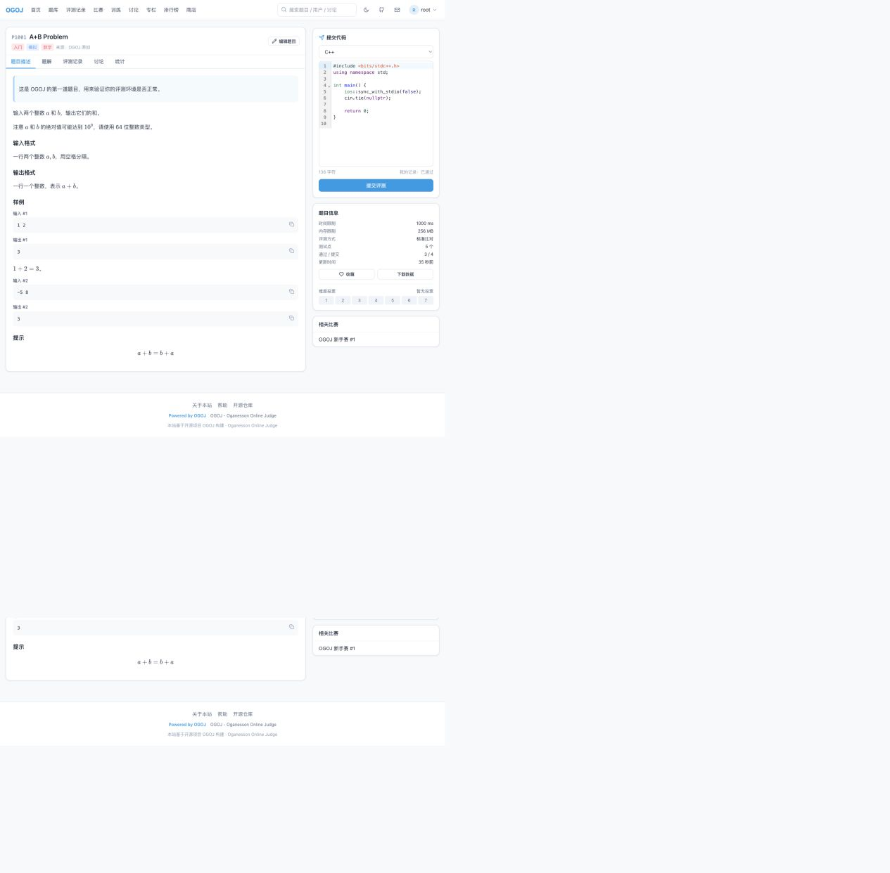
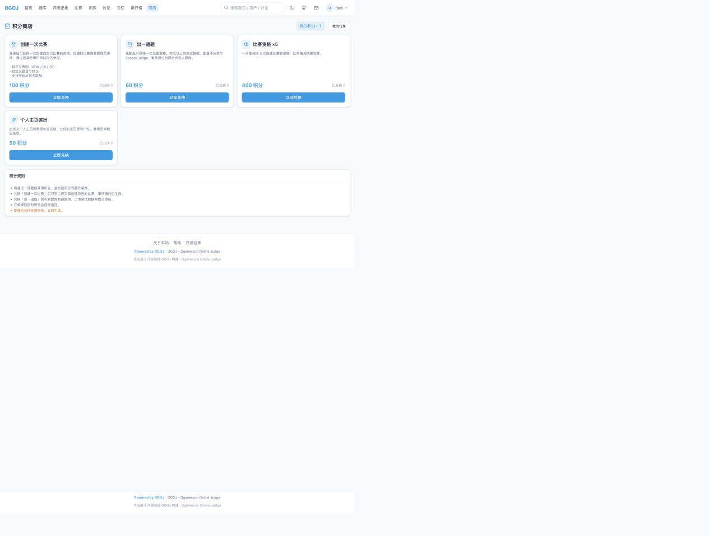
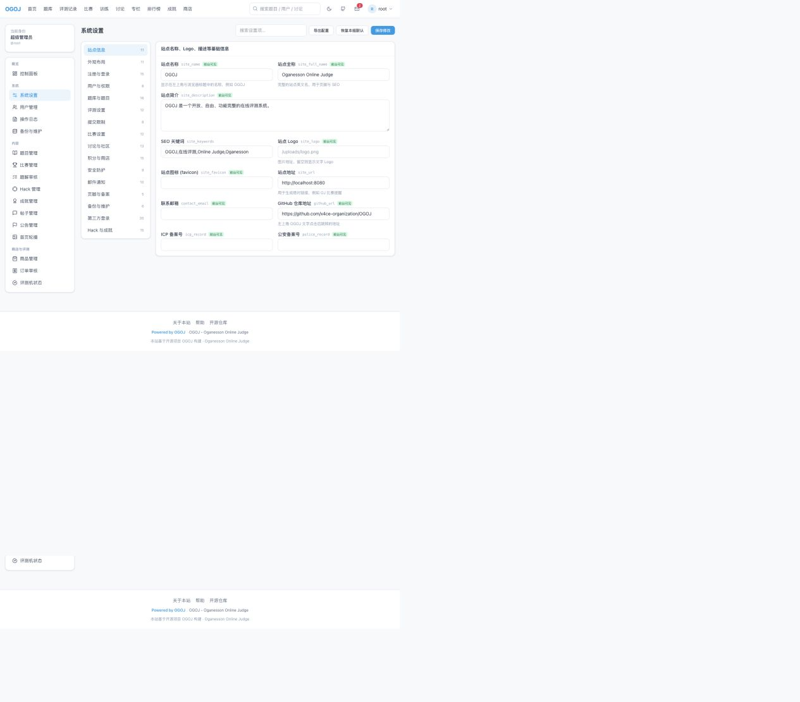
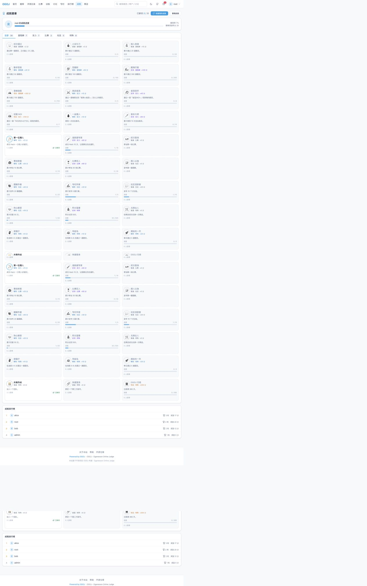
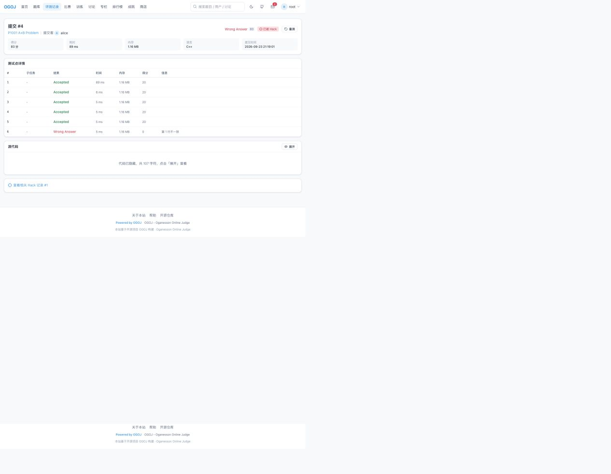

# OGOJ · Oganesson Online Judge

<div align="center">

**一个开源、完整、开箱即用的在线评测系统（Online Judge）**

题目 · 评测 · 比赛 · Hack · 成就徽章 · 第三方登录 · 讨论 · 题解 · 专栏 · 题单 · 团队 · 积分商店 · 系统设置

</div>

---

## 目录

- [功能一览](#功能一览)
- [技术栈](#技术栈)
- [快速部署（源码方式，推荐）](#快速部署源码方式推荐)
- [Docker 部署](#docker-部署)
- [首次登录与账号](#首次登录与账号)
- [目录结构](#目录结构)
- [评测机说明](#评测机说明)
- [系统设置](#系统设置)
- [积分与商店](#积分与商店)
- [权限模型](#权限模型)
- [备份、升级与维护](#备份升级与维护)
- [常见问题](#常见问题)
- [开源协议](#开源协议)

---

## 界面预览

| 首页 | 题目页 |
| --- | --- |
|  |  |

| 积分商店 | 系统设置 |
| --- | --- |
|  |  |

| 成就徽章 | Hack 记录 |
| --- | --- |
|  |  |

---

## 功能一览

### 题库与评测

| 功能 | 说明 |
| --- | --- |
| 题目列表 | 难度筛选、算法标签筛选、关键词搜索、完成状态筛选、多种排序、通过率显示 |
| 题面 | Markdown + LaTeX（KaTeX 渲染）、题目背景 / 输入输出格式 / 提示 / 样例 / 子任务说明 |
| 提交评测 | C、C++（14/17/20）、Python 3、PyPy 3、Java、JavaScript、Go、Rust，自动检测服务器可用编译器 |
| 评测结果 | AC / WA / TLE / MLE / RE / CE / OLE / PE / SE / UKOE，逐测试点显示时间、内存、得分与错误信息 |
| 子任务计分 | 捆绑测试（全部通过才得分）或按测试点累加，支持子任务依赖 |
| Special Judge | 自定义检查器，可为任意题目启用，支持部分分 |
| 交互题 | 通过 FIFO 管道与交互库通信 |
| 测试数据 | 逐点在线编辑，或 ZIP 批量导入（`1.in/1.out`、`a.in/a.ans` 成对命名），支持导出下载 |
| 重测 | 单条重测、按题目重测、按比赛重测、批量按编号重测 |
| **Hack 系统** | 构造数据攻击他人的 AC 提交，自动生成标准答案、重新评测、结算积分，数据可并入题库 |
| **成就徽章** | 30+ 内置徽章（题量 / 难度 / 首杀 / Hack / 比赛 / 社区 / 特殊），自动解锁、积分奖励、徽章墙与排行榜 |
| 题解 | 发布 / 点赞 / 踩 / 审核，可设置“通过题目后才可查看” |
| 题目讨论 | 每道题自带讨论区 |

### 比赛

- 三种赛制：**ACM**（通过数 + 罚时）、**OI**（分数，赛时隐藏排名）、**IOI**（分数，实时排名）
- 报名 / 取消报名、比赛密码、是否需要报名、非正式参赛（Star）
- 实时排行榜、封榜（freeze）、一血标记、赛后自动解封
- 比赛题目顺序自定义（A、B、C…），比赛期间他人代码不可见
- 比赛结束后一键**结算积分**，按名次发放奖励

### 社区

- 讨论区（多板块、置顶、锁定、搜索、按最新 / 最热 / 最新回复排序）
- 专栏文章（分类、封面、评论、置顶）
- 题解区、题目评论
- 站内信（系统通知、回复提醒、私信、订单通知）
- 关注 / 粉丝、用户排行榜、个人主页（通过题目、提交记录、比赛记录、难点分布、等级称号）

### 训练与团队

- 题单 / 训练计划：官方题单、用户题单，进度跟踪（未开始 / 进行中 / 已完成）
- 团队：创建 / 加入 / 退出、成员管理、团队公告、团队题目集

### 积分商店

- 通过题目获得积分（可配置每多少分、全站首杀额外奖励等）
- 商店商品可自由配置：**创建一次比赛**、**出一道题** 等，价格 / 库存 / 每人限购 / 上架状态均可由超级管理员修改
- 兑换 → 管理员审核 → 自动发放资格（配额），拒绝自动退还积分
- 用户凭资格自行创建比赛、自行出题，管理员审核后公开

### Hack 系统

- 对**别人的 Accepted 提交**发起 Hack：自己构造一组输入数据，系统用题目配置的**参考程序**运行出标准答案
- 数据会被加入该题的测试集并**重新评测**目标提交：
  - 目标提交变成非 AC（WA / TLE / MLE / RE…）→ **Hack 成功**，Hacker 获得积分，被 Hack 的提交标记为「已被 Hack」并同步到排行榜
  - 目标程序依然正确 → **Hack 失败**，数据不会污染题库（可在系统设置中改成永久保留）
- 失败可以扣分（默认不扣）、Hack 频率限制、数据大小限制、是否只能 Hack AC、是否允许 Hack 自己，均可在系统设置中调整
- 比赛维度：`比赛 → Hack` 标签页可以看到可 Hack 的提交与全部 Hack 记录；比赛可在创建时勾选「允许 Hack」「赛后继续开放 Hack」
- 题目维度：题目页 `Hack` 标签页；题目需要配置「Hack 参考程序」才能生成答案（Special Judge 题目可直接使用 checker）
- 管理员：`控制面板 → Hack 管理` 查看全部 Hack、重测或删除某条 Hack（删除会同时移除它引入的测试数据并回滚目标提交）

### 成就徽章

- 内置 30 个徽章，覆盖：通过题数、难度突破、全站首杀、Hack 成功、参赛场次、题解 / 专栏 / 讨论产出、积分、商店兑换、夜猫子 / 早起鸟、单日爆肝、团队、第三方登录绑定、注册满一年等
- 四个稀有度（普通 / 稀有 / 史诗 / 传说），解锁后自动发放站内信与积分奖励
- 用户可以在 `成就` 页面查看解锁进度、进度条与徽章墙，也可以随时点击「检查我的成就」手动结算
- 个人主页展示徽章墙；`成就` 页面附带**成就排行榜**（按徽章数量与徽章奖励积分排序）
- 管理员可以在 `控制面板 → 成就管理` 中新建 / 编辑 / 删除徽章（条件 = 类型 + 阈值，共 20 余种条件类型）、手动授予某个用户徽章

### 第三方登录（OAuth2）

- 内置 **GitHub / Gitee / Google** 三种预设，以及一个可对接任意 OAuth2 服务的「自定义」提供方
- 全部通过系统设置配置：启用开关、Client ID / Secret、授权 / 令牌 / 用户信息地址、Scope
- 支持三种账号策略：自动注册新账号、按邮箱自动绑定已有账号、仅允许已绑定账号登录
- 已登录用户可以在 `个人设置 → 第三方账号绑定` 绑定 / 解绑第三方账号
- 登录页会自动展示所有已启用的第三方登录按钮；接入自定义 OAuth2 服务时，用户信息接口需返回 `id`、`name`、`email`、`avatar_url`
- 回调地址格式：`https://你的域名/api/auth/oauth/<provider>/callback`（在系统设置里能看到当前站点对应的完整地址）

### 管理控制面板

- 控制面板：用户 / 题目 / 提交 / 比赛 / 社区 / 商店统计、近 14 天评测趋势图、评测机状态、最近管理操作
- **系统设置**：14 个分组、约 150 项可配置项（见下文）
- 用户管理：角色调整、封禁 / 解封、积分增减、重置密码、删除用户
- 题目管理：审核、编辑、测试数据管理、重测、软删除
- 比赛管理：创建 / 编辑 / 审核 / 结算 / 删除
- 内容管理：题解审核、帖子置顶锁定删除、公告、首页轮播图、专栏
- 商店：商品增删改、订单审核
- 评测：评测机状态、批量重测
- 日志：管理操作日志、登录日志
- 维护：数据库备份、VACUUM、评测日志清理、全站广播站内信

---

## 技术栈

| 层次 | 选型 |
| --- | --- |
| 前端 | React 18 + TypeScript + Vite + Tailwind CSS + React Router + CodeMirror 6 + KaTeX + Recharts |
| 后端 | Node.js 22 + Fastify 5 + TypeScript（原生 ESM） |
| 数据库 | SQLite（better-sqlite3，WAL 模式，零外部依赖） |
| 评测机 | 自研沙箱（rlimit + 墙钟看门狗 + RSS 采样 + `/usr/bin/time` 精确峰值内存），支持多语言、SPJ、交互题、子任务 |
| 鉴权 | JWT（HS256，无第三方依赖）+ bcrypt 密码哈希 |
| 部署 | 单进程（API + 内置评测 worker），也可用 Docker 一键部署 |

> 前端构建产物由后端直接托管，**生产环境只需要一个进程、一个端口**。

---

## 快速部署（源码方式，推荐）

### 1. 环境要求

| 依赖 | 版本 | 说明 |
| --- | --- | --- |
| Node.js | ≥ 20（推荐 22 LTS） | 运行时 |
| npm | ≥ 10 | 随 Node 安装 |
| g++ / gcc | 任意较新版本 | C / C++ 评测（必需） |
| python3 | ≥ 3.8 | Python 评测（可选） |
| javac / java | ≥ 11 | Java 评测（可选） |
| node | ≥ 20 | JavaScript 评测（可选，即上面安装的 Node） |
| go / rustc | 任意较新版本 | Go / Rust 评测（可选） |
| `/usr/bin/time` | GNU time 或 BSD time | 精确统计峰值内存（可选，建议安装） |

> 评测机启动时会自动探测以上编译器：**装了哪种语言就支持哪种语言**，未安装的语言不会出现在提交选项中。

### 2. 获取代码并安装依赖

```bash
git clone https://github.com/x4ce-organization/OGOJ.git
cd OGOJ
npm install
```

### 3. 配置环境变量

```bash
cp .env.example .env
```

编辑 `.env`，**至少修改 `JWT_SECRET`**：

```bash
openssl rand -hex 48     # 生成一个随机密钥
```

主要配置项：

| 变量 | 默认值 | 说明 |
| --- | --- | --- |
| `PORT` | `8080` | 服务端口 |
| `HOST` | `0.0.0.0` | 监听地址 |
| `SITE_URL` | `http://localhost:8080` | 站点对外地址 |
| `JWT_SECRET` | — | **必须修改**，登录令牌签名密钥 |
| `DATABASE_FILE` | `./data/ogoj.db` | SQLite 数据库文件 |
| `DATA_DIR` | `./data` | 测试数据、上传文件、备份存放目录 |
| `JUDGE_CONCURRENCY` | `2` | 同时评测的提交数量 |
| `JUDGE_ENABLED` | `true` | 是否在本进程内运行评测 worker |
| `ROOT_USERNAME` / `ROOT_PASSWORD` | `root` / `ogoj123456` | 初始化时创建的超级管理员 |

### 4. 初始化数据库与默认数据

```bash
npm run seed
```

该命令会：

1. 创建全部数据表（幂等，可重复执行）；
2. 创建超级管理员 `root / ogoj123456`；
3. 写入演示内容：示例用户（`admin`、`alice`、`bob`、`carol`）、5 道示例题目（含子任务与 Special Judge 示例）、2 场示例比赛、商店商品、公告、轮播图、讨论帖、题单、团队等。

> 如果想要一个全新的空站：`npm run reset`（清空全部数据后重新初始化）。

### 5. 构建并启动

```bash
npm run build     # 构建后端（tsc）与前端（vite）
npm start         # 生产模式启动，默认 http://localhost:8080
```

浏览器打开 `http://localhost:8080` 即可。

### 6. 开发模式

```bash
npm run dev       # 同时启动后端(8080) 与前端热更新(5173)
```

开发时访问 `http://localhost:5173`，Vite 会自动把 `/api`、`/uploads` 代理到后端。

### 7. 使用 systemd 常驻（Linux 示例）

```ini
# /etc/systemd/system/ogoj.service
[Unit]
Description=OGOJ Online Judge
After=network.target

[Service]
Type=simple
User=ogoj
WorkingDirectory=/opt/OGOJ
ExecStart=/usr/bin/npm start
Restart=always
RestartSec=5
Environment=NODE_ENV=production

[Install]
WantedBy=multi-user.target
```

```bash
sudo systemctl daemon-reload
sudo systemctl enable --now ogoj
```

如需 Nginx 反向代理 + HTTPS，把 `location /` 代理到 `http://127.0.0.1:8080` 即可（记得上传体积限制 `client_max_body_size 128m;`）。

### 8. 独立评测机（可选，多机 / 高并发）

评测任务保存在数据库队列中，因此可以在一台更强的机器上单独运行评测 worker：

```bash
npm run judge        # 仅运行评测 worker，不启动 HTTP 服务
```

只需让该机器能访问同一个数据库文件（例如通过共享存储）即可。也可以在同一台机器上启动多个 worker 进程。

---

## Docker 部署

镜像内置 C/C++、Python 3、Java、Node 评测环境（如需 Go / Rust，在 `Dockerfile` 中追加安装即可）。

```bash
git clone https://github.com/x4ce-organization/OGOJ.git
cd OGOJ

# 修改 docker-compose.yml 中的 JWT_SECRET！
docker compose up -d --build
```

容器首次启动会自动建表、写入默认超级管理员与演示数据，数据持久化在宿主机 `./data` 目录。

查看日志：

```bash
docker compose logs -f
```

---

## 首次登录与账号

| 账号 | 密码 | 角色 | 权限 |
| --- | --- | --- | --- |
| `root` | `ogoj123456` | **超级管理员** | 全部权限：控制面板、系统设置、用户管理、修改主站任意内容 |
| `admin` | `ogoj123456` | 普通管理员 | 题目管理、比赛管理、内容审核、订单审核、重测 |
| `alice` / `bob` / `carol` | `ogoj123456` | 普通用户 | 刷题、比赛、讨论、商店兑换 |

> **请首次登录后立即修改 root 密码**（右上角头像 → 个人设置 → 修改密码），并在 `.env` 中更换 `JWT_SECRET`。

---

## 目录结构

```
OGOJ/
├── apps/
│   ├── server/                  # 后端 + 评测机
│   │   └── src/
│   │       ├── db/              # 数据库连接、表结构、初始化数据
│   │       ├── judge/           # 评测引擎（沙箱、比对、SPJ、交互、队列 worker）
│   │       ├── lib/             # 鉴权、积分、通知、审计、工具函数
│   │       ├── routes/          # API 路由（用户/题目/提交/比赛/社区/商店/管理）
│   │       ├── settings/        # 系统设置注册表（全部可配置项）
│   │       ├── app.ts           # Fastify 应用装配
│   │       └── index.ts         # 服务入口
│   └── web/                     # 前端（React + Vite + Tailwind）
│       └── src/
│           ├── components/      # 通用组件（布局、编辑器、Markdown、分页、弹窗…）
│           ├── lib/             # API 客户端、鉴权上下文、格式化、Markdown 渲染
│           └── pages/           # 页面（含 pages/admin 控制面板）
├── data/                        # 运行时数据（数据库 / 测试数据 / 上传 / 备份）
├── Dockerfile
├── docker-compose.yml
├── .env.example
└── README.md
```

---

## 评测机说明

### 评测流程

1. 提交写入数据库并进入等待队列；
2. 评测 worker 原子地领取任务（多进程 / 多机安全）；
3. 在独立沙箱目录编译源码（编译错误直接返回 CE 与编译器输出）；
4. 逐测试点运行：**时间限制**（墙钟看门狗 + 进程组 SIGKILL）、**内存限制**（RSS 采样 + `/usr/bin/time` 峰值统计）、**输出限制**（`ulimit -f`）；
5. 比对答案（逐字节 / 忽略行末空格 / 忽略空白 / 浮点误差）或运行 Special Judge；
6. 按子任务汇总得分，写入评测详情、更新通过统计、结算积分。

### 支持的运行限制

- 时间：`题目时限 × 语言系数 × 全站倍率`，并额外给解释型语言留出虚拟机启动时间；
- 内存：题目内存 + 语言运行时开销（Java / Python / Node 等）；
- 输出：默认 64 KB（可在系统设置中调整）；
- 栈空间、CPU 时间由 `ulimit` 限制，进程组被整体回收，避免子进程残留。

### Special Judge 约定

检查器会收到三个命令行参数：

| 参数 | 含义 |
| --- | --- |
| `argv[1]` | 测试输入文件 |
| `argv[2]` | 选手输出文件 |
| `argv[3]` | 标准答案文件 |

返回 `0` 表示通过，返回非 `0` 表示不通过；在标准输出中打印 `score: 50` 可以给出部分分；返回码 `7` 会被判定为输出格式错误（PE）。

### 交互题约定

交互库同样接收参数：`argv[1]` 为测试输入文件，`argv[2]` 为写向选手程序的管道，`argv[3]` 为读取选手输出的管道；返回 `0` 通过，返回 `1` 答案错误，返回 `2` 格式错误。

---

## 系统设置

超级管理员可以在 **控制面板 → 系统设置** 中修改约 150 项配置，分为 14 个分组：

| 分组 | 可配置内容（节选） |
| --- | --- |
| 站点信息 | 站点名称、全称、简介、SEO 关键词、Logo、favicon、联系邮箱、**GitHub 仓库地址**、ICP/公安备案号 |
| 外观布局 | 主题色、默认配色模式、是否允许切换深色、页面宽度、首页模块开关、轮播间隔、首页公告条、**页脚文字**（默认 `Powered by OGOJ`）、页脚链接 |
| 注册与登录 | 注册开关、邀请码、邮箱后缀白名单、用户名长度与正则、禁用用户名、默认角色、会话时长、登录失败锁定、验证码 |
| 用户与权限 | 用户名是否可改、个人主页开关、默认隐藏提交记录、是否显示咕值、关注功能、等级名称与门槛、用户列表分页 |
| 题库与题目 | 题目编号前缀与起始值、默认/最大时限与内存、题库分页、标签与来源显示、难度投票、**用户出题开关与审核**、测试数据下载开关、SPJ 与交互题开关 |
| 评测设置 | 评测并发、启用语言、默认比对方式、比赛提交优先、编译超时、错误重测次数、时间倍率、输出上限、是否显示测试点结果与数据、数据更新自动重测 |
| 提交限制 | 是否允许提交、提交间隔、每日提交上限、代码长度上限、是否允许查看他人代码（含“通过后才可见”）、记录分页与默认筛选 |
| 比赛设置 | 默认赛制、**用户创建比赛开关与审核**、用户比赛最长时长、默认时长与分页、默认报名/排行榜/封榜、非正式参赛、积分权重 |
| 讨论与社区 | 讨论区/题目讨论/题解/专栏/评论开关、题解审核、分页、发帖间隔、发帖与发题解所需通过题数、敏感词、板块列表 |
| 积分与商店 | 积分开关、每题得分、首杀奖励、登录/题解/发帖/比赛奖励、是否允许负分、**商店开关与审核开关、默认商品价格**、售罄商品显示 |
| 安全防护 | 维护模式与提示语、维护时是否允许管理员访问、API 限流、上传大小上限、ZIP 导入开关、IP 黑名单、审计日志、强制 HTTPS |
| 邮件通知 | SMTP 服务器/端口/账号/密码/发件人、回复通知、评测通知、订单通知 |
| 页脚与备案 | 版权信息、开源协议、关于页面、用户协议、隐私政策 |
| 备份与维护 | 自动备份开关与间隔、保留份数、评测日志保留天数、首页统计口径、缓存时间 |
| **第三方登录** | 总开关、自动注册、按邮箱绑定、默认角色、登录页按钮开关、回调地址前缀，以及 GitHub / Gitee / Google / 自定义四个提供方的启用、Client ID、Client Secret、Scope、授权 / 令牌 / 用户信息地址 |
| **Hack 与成就** | Hack 开关、是否仅比赛中可 Hack、赛后是否继续开放、只能 Hack AC、允许 Hack 自己、成功 / 失败积分、频率与数据大小限制、数据是否并入题库、是否公开 Hack 数据与通知；成就开关、解锁通知、个人主页是否显示未解锁徽章 |

目前共有 **16 个分组、200+ 项设置**。所有设置都带类型校验（字符串 / 数字范围 / 开关 / 下拉 / JSON / 颜色 / 密码），并且可以一键导出为 JSON。

---

## 积分与商店

1. 用户每通过一道题目获得积分（默认 1 分，全站首杀额外 5 分，均可在系统设置中调整）；
2. 在 **商店** 用积分兑换商品：
   - **创建一次比赛**（默认 100 积分）
   - **出一道题**（默认 60 积分）
   - 也可自定义商品（例如“比赛资格 ×5”“个人主页装扮”等）
3. 兑换后生成订单，**超级管理员 / 普通管理员在 控制面板 → 订单审核 中通过或驳回**（驳回自动退还积分）；
4. 通过后系统给用户发放**配额（grant）**：
   - 有出题配额的用户可在题库页点击「新建题目」，上传测试数据并提交审核；
   - 有比赛配额的用户可在比赛页创建比赛，提交后等待审核；
5. 超级管理员可随时在 **控制面板 → 商品管理** 中修改价格、库存、每人限购、上下架状态，并新建 / 删除商品。

---

## 权限模型

| 角色 | 权限 |
| --- | --- |
| **普通用户** `user` | 刷题提交、参加比赛、发帖 / 题解 / 专栏、关注与私信、商店兑换、查看公开内容 |
| **普通管理员** `admin` | 以上全部 + 题目管理（含审核、测试数据、重测）、比赛管理、题解审核、帖子管理、公告与轮播、商店商品与订单审核、评测机状态与批量重测 |
| **超级管理员** `superadmin` | 以上全部 + 系统设置、用户管理（角色 / 封禁 / 积分 / 密码 / 删除）、操作日志与登录日志、备份与维护、全站广播、主站任意内容修改 |

默认超级管理员为 `root`。

---

## 备份、升级与维护

### 备份

需要同时备份两处，它们互相引用：

```bash
# 数据库（也可以用 控制面板 → 备份与维护 → 立即备份）
cp data/ogoj.db data/ogoj-$(date +%F).db

# 测试数据与上传文件
tar czf ogoj-data-$(date +%F).tar.gz data/testdata data/uploads
```

系统默认每天自动备份数据库到 `data/backups/`（可在系统设置中调整间隔与保留份数）。

### 升级

```bash
git pull
npm install
npm run build
npm run seed     # 只补齐缺失的数据表与默认数据，不会删除已有内容
sudo systemctl restart ogoj
```

### 恢复

```bash
sudo systemctl stop ogoj
cp data/backups/ogoj-manual-xxxx.db data/ogoj.db
sudo systemctl start ogoj
```

---

## 常见问题

**Q：提交时提示「评测机不支持该语言」？**
在服务器上安装对应编译器（例如 `apt install g++ python3 openjdk-17-jdk-headless`），然后重启服务；评测机启动时会自动探测。

**Q：macOS 上 `#include <bits/stdc++.h>` 编译失败？**
OGOJ 已内置兼容处理：检测到编译器缺少该头文件时，会自动生成兼容头并加入 include 路径，无需手动处理。

**Q：如何修改左上角的 OGOJ 名称？**
控制面板 → 系统设置 → 站点信息 → 站点名称。左上角文字点击后跳转的地址可在同组的「GitHub 仓库地址」中修改。

**Q：如何修改页面底部的 `Powered by OGOJ`？**
控制面板 → 系统设置 → 外观布局 → 页脚文字。

**Q：端口被占用 / 想换端口？**
修改 `.env` 中的 `PORT`，重启服务即可。

**Q：忘记 root 密码？**
```bash
# 重新初始化会重建 root 账号（注意：会清空全部数据）
npm run reset
```
或者连接数据库直接替换 `users.password_hash`（bcrypt 哈希）。

**Q：如何关闭注册、限制邮箱后缀？**
控制面板 → 系统设置 → 注册与登录。

**Q：第三方登录按钮不显示？**
需要在 控制面板 → 系统设置 → 第三方登录 中启用对应提供方并填写 Client ID 与 Client Secret。只填 ID 不启用、或 Secret 为空都不会显示按钮。

**Q：Hack 提示「该题目尚未配置 Hack 参考程序」？**
在题目编辑页 → 评测配置 → 允许 Hack 中填写**参考程序**（一份绝对正确的标准程序），系统用它来生成 Hack 数据的标准答案。Special Judge 题目可以跳过参考程序，直接由 checker 判定。

**Q：Hack 之后题目变难了，能撤销吗？**
可以。控制面板 → Hack 管理 → 删除对应记录，系统会移除该 Hack 引入的测试数据并重新评测被影响的提交。

---

## 开源协议

本项目以 **AGPL-3.0** 协议开源，见 [LICENSE](./LICENSE)。

仓库地址：<https://github.com/x4ce-organization/OGOJ>

<div align="center">

**Powered by OGOJ**

</div>
